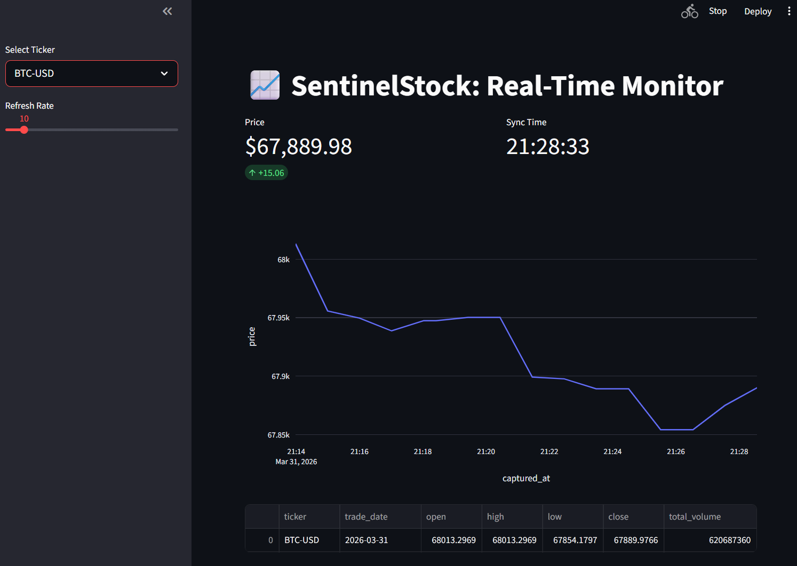

# 📈 SentinelStock: Real-Time Market Monitor

A high-performance, real-time stock monitoring system built with **Python**, **PostgreSQL**, and **Streamlit**. 



SentinelStock uses a "Smart DB" architecture, utilizing PostgreSQL as a powerful calculation engine (using Window Functions and Views) rather than just a simple storage bucket, ensuring fast and efficient data analysis.

## 🚀 Features
- **Real-Time Ingestion:** Asynchronous fetching of 1-minute stock data via `yfinance`.
- **SQL Analysis:** Uses **Window Functions** for Moving Averages and **Views** for Daily OHLC (Open, High, Low, Close) summaries.
- **Dockerized Environment:** The entire stack (Database, Ingestor, and Frontend) runs simultaneously with a single command.
- **Modern UI:** Streamlit dashboard featuring live metrics and dynamic Plotly charts.
- **Upsert Logic:** Self-healing database insertions prevent duplicate records and constraint crashes.
- **CI/CD Pipeline:** Automated code linting via GitHub Actions using Ruff.

## 🛠️ Setup & Installation

### 1. Clone the Repository
```bash
git clone [https://github.com/your-username/SentinelStock.git](https://github.com/your-username/SentinelStock.git)
cd SentinelStock
```

### 2. Configure the Environment
- Copy the template environment file to create your own:
  ```bash
  cp .env.example .env
  ```
- Open the `.env` file and update the `DB_PASSWORD` to a secure password of your choice.

### 3. Launch with Docker
Make sure Docker and Docker Compose are installed on your machine.
```bash
docker-compose up --build
```
*Note: The PostgreSQL database schema, high-performance indexes, and SQL views will initialize automatically on the first boot.*

### 4. Access the Dashboard
Once the containers are running and the ingestor has completed its first fetch, open your web browser and visit:
👉 **[http://localhost:8501](http://localhost:8501)**

## 🏗️ Architecture & Tech Stack
- **Database Engine:** PostgreSQL 16 (Time-series optimization & B-Tree Indexing)
- **Data Ingestor Worker:** Python 3.12 (`asyncio`, `yfinance`, `psycopg2` batch execution)
- **Frontend Visualization:** Streamlit & Plotly Express
- **Infrastructure & Orchestration:** Docker & Docker Compose

## 🤝 Contributing

Contributions, issues, and feature requests are welcome! If you have a suggestion that would make this better, please fork the repo and create a pull request.

1. **Fork the Project**
2. **Create your Feature Branch:** `git checkout -b feature/AmazingFeature`
3. **Format & Lint your code:** Run `ruff check . --fix` locally to ensure it passes the CI pipeline.
4. **Commit your Changes:** `git commit -m 'Add some AmazingFeature'`
5. **Push to the Branch:** `git push origin feature/AmazingFeature`
6. **Open a Pull Request**

## 📄 License
Distributed under the MIT License. See `LICENSE` for more information.